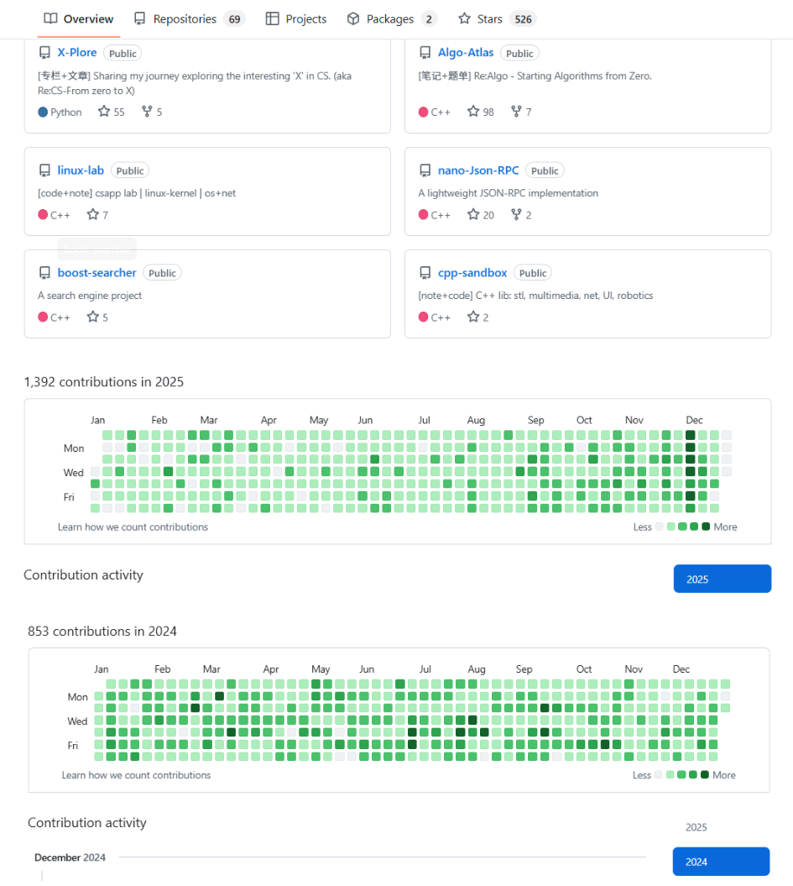
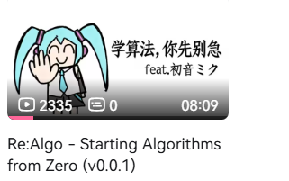

# 2025sum碎碎念

这篇文章作为[2025年末总结]的预告吧

（&最近准备期末周去了,1.10完全考完orz，这篇文章是帖子的backsup）

最开始准备叫摸鱼编程的，学校老师的课没怎么听进去，可能自己摸鱼了七八千个小时，上课用手机摸/睡觉，下课用电脑/熬夜摸，凭兴趣想到什么摸什么...感谢大学学计算机带来的独立思考时光

上一篇文章收到了一些交流邮件，把被提到的仓库代码简单整理了一下，主要是linux部分，整理了应该有1/5，寒假准备把剩下的4/5整理出来，博客是根据代码思考写的，这样看文章想跑一下代码，把仓库clone下来就行

主页放的项目是一年多前写的简单项目，适合用C++写项目入门，大家有什么想法/问题都可以提pr/issue，项目重构了一半，去做别的事情了，大家感兴趣可以继续写，寒假应该会把做过的demo都完善后列出list

最近在用rust做后端，对web3infra Orion Server Buck2 restructures logs,  暑假主要做的偏C和图形学方向，Contributed to Xiaomi OpenVela open-source project by adding a music player feature. 如果好奇开源Like coding & Curious about computer science就可以去做啦，预祝大家都可以找到自己感兴趣的事情

其实写这篇文章是突然想到给b站算法学习的视频重做了一个封面，为了引出前面写了一大堆(，笑了半天才发出来这个封面...给大家期末周也乐一下吧，期末复习也先别急bush

b站开的同id小号，目前只发了这个抽象的视频，寒假准备跟上时代尝试做一些视频

之前做的主要是文字分享，七月前用的这个博客，可以根据 X-Plore repo的整合目录跳转看需要的文章，太多了直接翻可能不太好翻，七月后本地笔记的文章backsup到了lvynote.github.io，上面账号上都记的自言自语，还有一些随手的复习了

---

还有没事干可能也会建一个仓库 整理一些计算机之外的东西 一些关于事情的理解与思考 写东西使我快乐

~~完全把github当云端了~~
